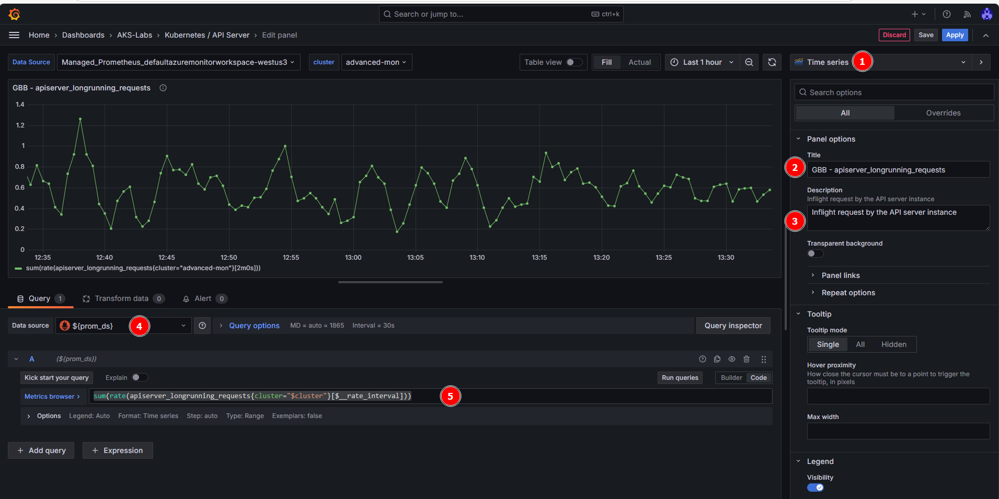

### Advanced Observability Concepts

**Objectives**

* Enable and Visualize Control Plane Metrics: using *Azure Managed Grafana*.
* Customize Metric Collection: through `ConfigMaps` and enabling additional *Prometheus metrics*.
* Implement Custom Scrape Jobs: using `PodMonitor` and `ServiceMonitor` CRDs to collect application-specific metrics in **Azure Managed Prometheus**.

>[!Note]
>To install or update the `aks-preview` extension you can use the following commands:
>```bash
># Install the aks-preview extension
>az extension add --name aks-preview
>
># Update the aks-preview extension
>az extension update --name aks-preview
> ```

### AKS control plane metrics

**To enable the feature:**

1. Register the `AzureMonitorMetricsControlPlanePreview` feature flag using the az feature register command.

  ```bash
  az feature register \
  --namespace "Microsoft.ContainerService" \
  --name "AzureMonitorMetricsControlPlanePreview"
  ```

2. Once the feature is registered, refresh resource provider.

  ```bash
  az provider register --namespace Microsoft.ContainerService
  ```

### Setup your environment

**Step 1: Define your environment variables and placeholders**

* Declaring the following environment variables:

```bash
cat <<EOF> .envrc
export RG_NAME="rg-advanced-observability"
export LOCATION="westus3"

# Azure Kubernetes Service Cluster
export AKS_CLUSTER_NAME="advanced-mon"

# Azure Managed Grafana
export GRAFANA_NAME="aks-labs-${RANDOM}"

# Azure Monitor Workspace
export AZ_MONITOR_WORKSPACE_NAME="azmon-aks-labs"
EOF
```

* Load the environment variables:

```bash
source .envrc
```

---

### Step 2: Create the Azure Monitor Workspace

**Create the resource group**

```bash
# Create resource group
az group create --name ${RG_NAME} --location ${LOCATION}
```

**Create an Azure Monitor Workspace**

```bash
az monitor account create \
  --resource-group ${RG_NAME} \
  --location ${LOCATION} \
  --name ${AZ_MONITOR_WORKSPACE_NAME}
```

**Retrieve the Azure Monitor Workspace ID**

```bash
AZ_MONITOR_WORKSPACE_ID=$(az monitor account show \
  --resource-group ${RG_NAME} \
  --name ${AZ_MONITOR_WORKSPACE_NAME} \
  --query id -o tsv)
```

---

### Step 3: Create an Azure Managed Grafana instance


- Add the Azure Managed Grafana extension to `az cli`.

* Create an Azure Managed Grafana instance.

+ Save the Azure Manage Grafana Resource identity which will later be attached to the AKS cluster.


>[!Important]
>The Azure CLI extension for Azure Managed Grafana (`amg`) allows us to create, edit, delete the Azure Managed Grafana instance from the cli. If you can't add this extension, you can still perform these actions using the Azure Portal.

**1. Add the Azure Manage Grafana extension to `az cli`:**

```bash
az extension add --name amg
```

**2. Create an Azure Managed Grafana instance:**

```bash
az grafana create \
  --name ${GRAFANA_NAME} \
  --resource-group $RG_NAME \
  --location $LOCATION
```

**3. Once created, save the Grafana resource ID**

```bash
GRAFANA_RESOURCE_ID=$(az grafana show \
  --name ${GRAFANA_NAME} \
  --resource-group ${RG_NAME} \
  --query id -o tsv)
```

### Step 4: Create a new AKS cluster

**1. Create a new AKS cluster and attach the Grafana instance to it**


**The Culprit: POSIX Path Conversion**

When Git Bash sees a string starting with `/subscriptions/...`, it assumes it’s a Windows file path and often prepends `C:\Program Files\Git...` to it before sending it to the Azure CLI. This breaks the specific regex pattern the `aks-preview` extension is looking for.

---

### The Fix: Disable Path Conversion

You can fix this by setting an environment variable specifically for this command to tell Git Bash **"don't touch my paths."**

Try running the command with `MSYS_NO_PATHCONV=1` prefixed to it:

```bash
MSYS_NO_PATHCONV=1 az aks create \
  --name ${AKS_CLUSTER_NAME}  \
  --resource-group ${RG_NAME} \
  --node-count 1 \
  --enable-managed-identity  \
  --enable-azure-monitor-metrics \
  --enable-cost-analysis \
  --grafana-resource-id ${GRAFANA_RESOURCE_ID} \
  --azure-monitor-workspace-resource-id ${AZ_MONITOR_WORKSPACE_ID} \
  --tier Standard
```
**2. Get the credentials to access the cluster:**

```bash
az aks get-credentials \
  --name ${AKS_CLUSTER_NAME} \
  --resource-group ${RG_NAME} \
  --file aks-labs.config
```
**3. Use the retrieved aks-labs.config file as your KUBECONFIG and add it to your environment**

```bash
echo export KUBECONFIG=$PWD/aks-labs.config >> .envrc
source .envrc
```
**4. Check that the credentials are working:**

```bash
kubectl cluster-info
kubectl get nodes
```

---

### Working on Grafana

**1. Create a folder in Grafana to host our new dashboards:**

```bash
az grafana folder create \
  --name ${GRAFANA_NAME} \
  --title AKS-Labs \
  --resource-group ${RG_NAME}
```

**2. Import the kube-apiserver and etcd dashboards into the new Grafana folder:**

```bash

# import kube-apiserver dashboard
az grafana dashboard import \
  --name ${GRAFANA_NAME} \
  --resource-group ${RG_NAME} \
  --folder 'AKS-Labs' \
  --definition 20331

# import etcd dashboard
az grafana dashboard import \
  --name ${GRAFANA_NAME} \
  --resource-group ${RG_NAME} \
  --folder 'AKS-Labs' \
  --definition 20330
```

**3. To access the Grafana Dashboard**

```bash
GRAFANA_UI=$(az grafana show \
  --name ${GRAFANA_NAME} \
  --resource-group ${RG_NAME} \
  --query "properties.endpoint" -o tsv)

echo "Your Azure Managed Grafana is accessible at: $GRAFANA_UI"
```

Expected Output:

```
https://aks-labs-test-ase8bmffcgbqhjej.wus3.grafana.azure.com
```

* Now you, should be able to browse to your Azure Managed Grafana instance and see the `kube-apiserver` and `etcd` metrics dashboards in the AKS-Labs folder.
* The new `kube-apiserver` metrics dashboard in Grafana.

>[!Note]
>It might take up to 5 minutes for data to start showing up in your Grafana dashboard. You can refresh this page or set it to auto-refresh every few seconds

---

### Example: Customizing the collection of metrics

* Now have the `kube-apiserver` and the `etcd` metrics being collected by Prometheus and displayed on Grafana. 
* If you want to collect a different set of metrics, you can do so by manually enabling them and this can be done by deploying a ConfigMap named [ama-metrics-settings-configmap](https://github.com/Azure/prometheus-collector/blob/main/otelcollector/configmaps/ama-metrics-settings-configmap.yaml) in the `kube-system` namespace.
<br>

Here are some options:

* [Ingest only minimal metrics from default targets](https://learn.microsoft.com/en-us/azure/aks/control-plane-metrics-monitor#ingest-only-minimal-metrics-from-default-targets)

* [Ingest all metrics from all targets](https://learn.microsoft.com/en-us/azure/aks/control-plane-metrics-monitor#ingest-all-metrics-from-all-targets)

* [Ingest a few other metrics in addition to minimal metrics](https://learn.microsoft.com/en-us/azure/aks/control-plane-metrics-monitor#ingest-a-few-other-metrics-in-addition-to-minimal-metrics)

* [Ingest only specific metrics from some targets](https://learn.microsoft.com/en-us/azure/aks/control-plane-metrics-monitor#ingest-only-specific-metrics-from-some-targets) - we are covering this example in the next section

---

### Ingesting a new metric: apiserver_longrunning_requests

**Ingest only specific metrics from specific targets**


* lets edit the `ama-metrics-settings-configmap` to include a metric that is not a part of the [minimal ingestion profile](https://learn.microsoft.com/azure/azure-monitor/containers/prometheus-metrics-scrape-configuration-minimal): `apiserver_longrunning_requests`. 
* This metric will be collected from the `controlplane-apiserver` target.

**apiserver_longrunning_requests** = Guage of all active long-running apiserver requests

>[!Note]
>A full list of the available metrics is available at the [Kubernetes Metrics Reference](https://kubernetes.io/docs/reference/instrumentation/metrics/).

### Steps to customize the collection of a new metric:

1. Run the following command to deploy the **ama-metrics-settings-configmap** in the **kube-system namespace**.

```bash
kubectl apply -f https://raw.githubusercontent.com/Azure/prometheus-collector/refs/heads/main/otelcollector/configmaps/ama-metrics-settings-configmap.yaml
```

2. Edit the **ama-metrics-settings-configmap** to enable the metrics you want to collect. Run the following command to edit the **ama-metrics-settings-configmap**.
```bash
kubectl edit cm ama-metrics-settings-configmap -n kube-system
```

3. Under the **default-targets-metrics-keep-list**, add **apiserver_longrunning_requests** and then save the **ConfigMap**.

```
controlplane-apiserver = "apiserver_longrunning_requests"
```

It might take 1 minute for the new metric to start showing up. We can check it in the Azure Monitor Workspace and then on Grafana.

---

1. Navigate to the **Azure Monitor Workspace** attached to the AKS cluster. 

`AKS Cluster` → left menu → `Monitor` → `Monitor settings` → `Azure Monitor workspace` link

Once in the ` Azure Monitor workspace` → left menu → `Managed Prometheus` → `Prometheus Explorer` → in the `PromQL` searching box → run `apiserver_longrunning_requests`


---

### Create a dashboard in Grafana to visualize the new metric

- Navigate to your Manage Grafana Instance, click on `Dashboards`→`AKS-Labs`→`API Server`
- Click on `Add` top right corner of webpage and then `Visualization`
- Verify that your selected `Data Source`(In edit panel webpage -> Query section) is `${prom_ds}`
- To customize the visualization, we need to first toggle the `Code` button in the `Query` part of the panel:(Can find on right corner of the Query section discussed above)


1. Create a new `Time series` dashboard (should be the default visualization).
2. Add a `Title` (e.g.: apiserver_longrunning_requests)
3. Add a `Description` (e.g.: Gauge of all active long-running apiserver requests broken out by verb, group, version, resource, scope and component.).
4. Make sure the Managed Prometheus (`${prom_ds}`) is selected in the Data source.
5. In the metrics browser, add this query:

```bash
sum(rate(apiserver_longrunning_requests{cluster="$cluster"}[$__rate_interval]))
```
6. Click on Save(top right corner of the webpage)
7. Finally, click on Save Dashboard

> After close to 5 minutes, you should start seeing the `apiserver_longrunning_requests` metrics showing up in your new dashboard

>[!Note]
>The Azure team does not offer a [pre-built dashboard](https://grafana.com/orgs/azure/dashboards) for some of these metrics, but you can reference the doc on [supported metrics for Azure Managed Prometheus](https://learn.microsoft.com/azure/aks/monitor-aks-reference#supported-metrics-for-microsoftcontainerservicemanagedclusters) and create your own dashboards in Azure Managed Grafana or search for community dashboards on Grafana.com and import them into Azure Managed Grafana. Just be sure to use the Azure Managed Prometheus data source.

---

### Custom scrape jobs for Azure Managed Prometheus

- when you want to scrape metrics from a target, you would create a scrape job in Prometheus.
- With **Azure Managed Prometheus**, you can define custom scrape jobs for your AKS cluster using the `PodMonitor` and `ServiceMonitor` **Custom Resource Definitions (CRDs)**, which are automatically created when you enable Azure Managed Prometheus.
<br>
These CRDs are nearly identical to their open-source Prometheus counterparts, with the main difference being the apiVersion.