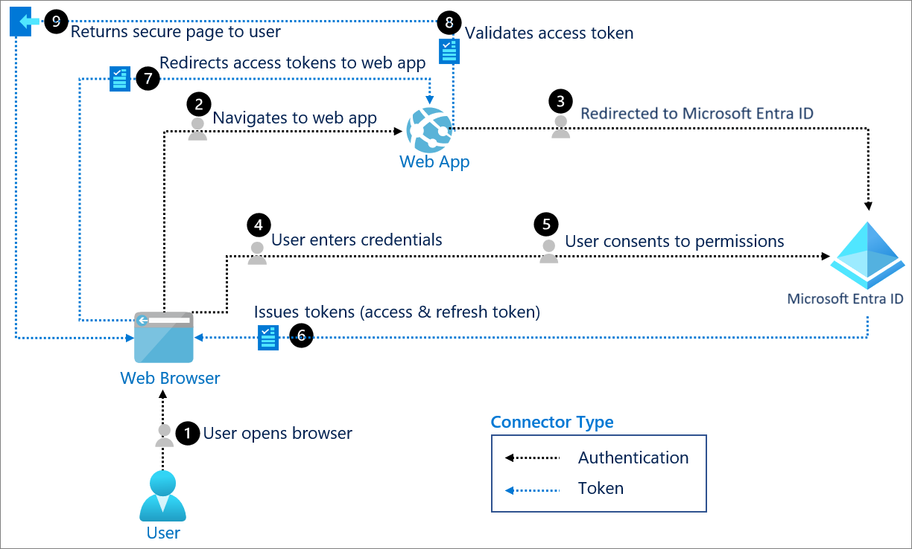

# Security

## Identity and Access Management (IAM) fundamentals

### What is identity and access management

* Identity and access management ensures that the right people, machines, and software components access the right resources at the right time.

**IAM systems typically provide the following core functionality:**

* **Identity management:** The process of creating, storing, and managing identity information.
* **Identity providers (IdP)** creates, maintains, and manages identity information. It offers authentication, authorization, and auditing services.
  * It lets organizations establish authentication and authorization policies, monitor user behavior, identify suspicious activities, and reduce malicious attacks.
  * *Microsoft Entra* is an example of a cloud-based identity provider. Other examples include X, Google, Amazon, LinkedIn, and GitHub.
* **Identity federation:** Allow users who already have passwords elsewhere (for example, in your enterprise network or with an internet or social identity provider) to access your system.
* **Provisioning and deprovisioning of users:** Create and manage user accounts, including specifying which users can access which resources and assigning permissions and access levels.
* **Authentication:** proves the identity of a user, machine, or software component.
  * It's sometimes shortened to `AuthN`.
  * `OpenID Connect` protocol is used for authentication.
* **Authorization:** grants or denies the user, machine, or software component access to certain resources.
  * It's sometimes shortened to `AuthZ`.
  * `OAuth 2.0` protocol is used for handling authorization.
  * The Microsoft cloud also has other authorization systems such as `Microsoft Entra built-in roles`, `Azure RBAC`, and `Exchange RBAC`.
* **Access control:** The process of determining who or what has access to which resources. This process includes defining user roles and permissions, as well as setting up authentication and authorization mechanisms.
* **Reports and monitoring:** Generate reports about platform actions (such as sign-in time, systems accessed, and type of authentication) to ensure compliance and assess security risks.
* **Single sign-on (SSO)** lets users authenticate their identity once and then silently authenticate later when accessing various resources that rely on the same identity. It removes the need for signing on to multiple, separate target systems.
* **Multifactor authentication** is the act of providing another factor of authentication to an account.
  * This is often used to protect against brute force attacks.
  * It's sometimes shortened to `MFA` or `2FA`.
  * The Microsoft Authenticator can be used as an app for handling two-factor authentication.

---

### Identity

* A digital identity is a collection of unique identifiers or attributes that represent a person, software component, machine, asset, or resource in a system. An identifier can be:
  * An email address
  * Sign-in credentials (username/password)
  * A bank account number
  * A government issued ID
  * A MAC address or IP address

**Identities are used to authenticate and authorize access to resources, enable communication, facilitate transactions, and serve other purposes.**

Identities are categorized into four types:

* **Human identities** represent people, including employees (internal and frontline workers) and external users (customers, consultants, vendors, and partners).
* **Workload identities** represent software workloads such as an application, service, script, or container.
* **Device identities** represent devices, including desktop computers, mobile phones, IoT sensors, and IoT-managed devices. They're distinct from human identities.
* **Agent identities** represent AI agents that act autonomously or on behalf of users. Microsoft Entra Agent ID provides purpose-built identity constructs to authenticate, authorize, govern, and protect these identities at enterprise scale.

---

### Roles in OAuth 2.0

* Four parties are generally involved in an OAuth 2.0 and OpenID Connect authentication and authorization exchange.
* These exchanges are often called *authentication flows or auth flows*.

<br>

* **Authorization server** - The Microsoft identity platform is the authorization server. It securely handles the end-user's information, their access, and the trust relationships between the parties in the auth flow. The authorization server issues the security tokens your apps and APIs use for granting, denying, or revoking access to resources (authorization) after the user has signed in (authenticated).
* **Client** - The client in an OAuth exchange is the application requesting access to a protected resource.
  * The client could be a web app running on a server, a single-page web app running in a user's web browser, or a web API that calls another web API.
  * You'll often see the client referred to as *client application, application, or app*.
* **Resource owner** - The resource owner in an auth flow is usually the application user, or end-user in OAuth terminology.
  * The end-user "owns" the protected resource (their data) which your app accesses on their behalf.
  * The resources owners can grant or deny your app (the client) access to the resources they own.
  * For example, your app might call an external system's API to get a user's email address from their profile on that system.
  * Their profile data is a resource the end-user owns on the external system, and the end-user can consent to or deny your app's request to access their data.
* **Resource server** - The resource server hosts or provides access to a resource owner's data.
  * Most often, the resource server is a web API fronting a data store.
  * The resource server relies on the authorization server to perform authentication and uses information in bearer tokens issued by the authorization server to grant or deny access to resources.

Let's translate these roles into a simple real-world analogy: **Checking into a hotel with a digital keycard.**

---

### The Hotel Analogy

Imagine you booked a hotel room. You arrive at the building and want to get into your room to drop off your bags.

Here is how the four Azure/OAuth concepts map to your hotel stay:

| Concept | The Hotel Equivalent | What it does in Azure |
| --- | --- | --- |
| **Resource Owner** | **You (the Guest)** | The actual user logging in. You own your personal data (like your email list or files) and get to decide who gets to see it. |
| **Client** | **The Keycard** *(or the phone app you use to request the key)* | The application (like a mobile app or website) trying to act on your behalf to get access. |
| **Authorization Server** | **The Front Desk** | **Microsoft Entra ID**. This is the secure system that checks your ID, confirms who you are, and hands your app a digital keycard (a **token**). |
| **Resource Server** | **The Hotel Room Door** | The API hosting the actual data (like Microsoft Graph, Azure Storage, or your custom database). It doesn't know who you are; it just reads the keycard (token) to unlock the door. |

---

### How they work together (The Flow)

If we map this to the diagram above, the steps play out like this:

1. **Access Service:** You (**Resource Owner**) open a third-party trip-planning app (**Client**) and tell it to show your upcoming hotel stays.
2. **Grant Access:** The app doesn't ask for your password directly. Instead, it sends you to the Microsoft Entra login screen (**Authorization Server**). You type in your credentials and consent to letting the app see your emails.
3. & 4. **Issue Token:** The "Front Desk" (**Authorization Server**) verifies your password and hands a secure, temporary digital keycard (an **Access Token**) back to the trip-planning app (**Client**).
4. **Access Data:** The app (**Client**) takes that keycard and presents it to the Microsoft Outlook API (**Resource Server**). The door reads the keycard, sees it is valid and approved by Microsoft Entra, and opens up to let the app read your email data.

In short: **You** (Owner) log into **Entra ID** (Auth Server) to give a **website** (Client) a virtual keycard so it can read your data from an **API** (Resource Server).

---

### Tokens

* The parties in an authentication flow use bearer tokens to assure, verify, and authenticate a principal (user, host, or service) and to grant or deny access to protected resources (authorization).
* Bearer tokens in the Microsoft identity platform are formatted as JSON Web Tokens (JWT).

Three types of bearer tokens are used by the identity platform as security tokens:

* **Access tokens** - Access tokens are issued by the authorization server to the client application.
  * The client passes access tokens to the resource server.
  * Access tokens contain the permissions the client has been granted by the authorization server.
* **ID tokens** - ID tokens are issued by the authorization server to the client application.
  * Clients use ID tokens when signing in users and to get basic information about them.
* **Refresh tokens** - The client uses a refresh token, or RT, to request new access and ID tokens from the authorization server.
  * Your code should treat refresh tokens and their string content as sensitive data because they're intended for use only by authorization server.

---

### Endpoints

* Standards-compliant authorization servers like the identity platform provide a set of HTTP endpoints for use by the parties in an auth flow to execute the flow.
* The endpoint URIs for your app are generated automatically when you register or configure your app.
* Two commonly used endpoints are the authorization endpoint and token endpoint. Here are examples of the `authorize` and `token` endpoints:

```bash
# Authorization endpoint - used by client to obtain authorization from the resource owner.
https://login.microsoftonline.com/<issuer>/oauth2/v2.0/authorize
# Token endpoint - used by client to exchange an authorization grant or refresh token for an access token.
https://login.microsoftonline.com/<issuer>/oauth2/v2.0/token

# NOTE: These are examples. Endpoint URI format may vary based on application type,
#       sign-in audience, and Azure cloud instance (global or national cloud).

#       The {issuer} value in the path of the request can be used to control who can sign into the application. 
#       The allowed values are **common** for both Microsoft accounts and work or school accounts, 
#       **organizations** for work or school accounts only, **consumers** for Microsoft accounts only, 
#       and **tenant identifiers** such as the tenant ID or domain name.
```

---

## Microsoft Entra ID

### Intro

* Microsoft Entra ID is part of the platform as a service (PaaS)
* Microsoft Entra ID is a cloud-based identity and access management service provided by Microsoft.
* Microsoft Entra ID is a comprehensive solution for managing identities, enforcing access policies, and securing applications and data in the cloud and on-premises.
* With only Microsoft Entra ID, you get support for multi-factor authentication, identity protection, and self-service password reset.
* With Microsoft Entra ID:
    * Configure access to applications
    * Configure single sign-on (SSO) to cloud-based SaaS applications
    * Managing users and groups
    * Provisioning users
    * Enabling federation between organizations
    * Providing an identity management solution
    * Identifying irregular sign-in activity
    * Configure multi-factor authentication
    * Extending existing on-premises Active Directory implementations to Microsoft Entra ID
    * Configure Application Proxy for cloud and local applications
    * Configure Conditional Access for users and devices
* Any new Azure subscription automatically includes a Microsoft Entra tenant.

>[!Note]
>By default, when you create a new Azure subscription by using a Microsoft account, the subscription automatically includes a new Microsoft Entra tenant named Default Directory.
>
<br>

- **AD DS** is a directory service that provides the methods for storing directory data, such as user accounts and passwords, and makes this data available to network users, administrators, and other devices and services. It runs as a service on Windows Server, referred to as a domain controller.

---

### Microsoft Entra tenants

* Microsoft Entra ID is multi-tenant by design and is implemented specifically to ensure isolation between its individual directory instances.
* The term **tenant** in this context typically represents a company or organization that signed up for a subscription to a Microsoft cloud-based service such as Microsoft 365, Intune, or Azure, each of which uses Microsoft Entra ID.
* The term **tenant** represents an individual **Microsoft Entra instance**.
* We can create multiple Microsoft Entra tenants, but each subscription must be **associated with one and only one** Microsoft Entra tenant.

> [!Note]
> You can associate the same Microsoft Entra tenant with multiple Azure subscriptions. This allows you to use the same users, groups, and applications to manage resources across multiple Azure subscriptions.

* Each Microsoft Entra tenant is assigned the default **Domain Name System (DNS)** domain name, consisting of a unique prefix derived from the name of the Microsoft account you use to create an Azure subscription or provided explicitly when creating a Microsoft Entra tenant, is followed by the `onmicrosoft.com` suffix.
* You can also add at least one **custom domain name** to the same Microsoft Entra tenant.
* This name utilizes the DNS domain namespace that the corresponding company or organization owns.

---

### Microsoft Entra schema

* The Microsoft Entra schema contains fewer object types than that of AD DS.
* It doesn't include a definition of the computer class.
* Microsoft Entra ID's primary strength lies in providing directory services; storing and publishing user, device, and application data; and handling the authentication and authorization of the users, devices, and applications.

---

## Identities and applications in Microsoft Entra ID

### Workload identity

* A workload identity is an identity you assign to a software workload (such as an application, service, script, or container) to authenticate and access other services and resources.
* In Microsoft Entra, workload identities are applications, service principals, and managed identities.

---

### Application registration

- In order to allow an application to integrate with and delegate Identity and Access Management functions to Microsoft Entra ID, it must be registered with a Microsoft Entra tenant.
- When you register your application with Microsoft Entra ID, you're providing an identity configuration for your application, allowing it to integrate with Microsoft Entra ID and use features like:
  - Robust management of single sign-on using Microsoft Entra identity management and OpenID Connect protocol implementation
  - Brokered access to protected resources by client applications, via OAuth 2.0 authorization server
  - Consent framework for managing client access to protected resources, based on resource owner authorization.
- When you register an app, you choose whether it's a single tenant, or multitenant, and can optionally set a redirect URI.
- When you've completed the app registration, you have a globally unique instance of the app (the application object) that lives within your home tenant or directory.
- You also have a globally unique ID for your app (the app/client ID).
- You can add secrets or certificates and scopes to make your app work, customize the branding of your app in the sign-in dialog, and more.
- If you register an application, an **application object** and a **service principal object** are automatically created in your home tenant.
- Your client app needs a way to trust the security tokens issued to it by the Microsoft identity platform. The first step in establishing trust is by registering your app. When you register your app, the identity platform automatically assigns it some values, while others you configure based on the application's type.

**Two of the most commonly referenced app registration settings are:**

* **Application (client) ID** - Also called *application ID* and *client ID*, this value is assigned to your app by the identity platform.
  * The client ID uniquely identifies your app in the identity platform and is included in the security tokens the platform issues.
* **Redirect URI** - The authorization server uses a redirect URI to direct the resource owner's user-agent (web browser, mobile app) to another destination after completing their interaction.
  * For example, after the end-user authenticates with the authorization server.
  * Not all client types use redirect URIs.

App registration also holds information about the authentication and authorization endpoints you'll use in your code to get ID and access tokens.

---

### Application object

- When you register/update an application, both an application object and a corresponding service principal object are created/updated for that tenant.
- An application object is used as a template or blueprint to create one or more service principal objects.
- A service principal is created in every tenant where the application is used.

**The application object describes three aspects of an application:**

  - How the service can issue tokens in order to access the application
  - The resources that the application might need to access
  - The actions that the application can take

For more information, see [Application and Service Principal Objects](https://learn.microsoft.com/en-us/entra/identity-platform/app-objects-and-service-principals).

---

### Service principal object

* To access resources that are secured by a Microsoft Entra tenant, the entity that requires access must be represented by a security principal.
* This requirement is true for both **users (user principal)** and **applications (service principal)**.
* The security principal defines the access policy and permissions for the user/application in the Microsoft Entra tenant.
* This enables core features such as authentication of the user/application during sign-in, and authorization during resource access.

**There are three types of service principal:**

- **Application**
  - This type of service principal is the local representation, or application instance, of a global application object in a single tenant or directory.
  - In this case, a service principal is a concrete instance created from the application object and inherits certain properties from that application object.
  - A service principal is created in each tenant where the application is used and references the globally unique app object.
  - The service principal object defines what the app can actually do in the specific tenant, who can access the app, and what resources the app can access.
  - When an application is given permission to access resources in a tenant (upon registration or consent), a service principal object is created.
  - When you register an application, a service principal is created automatically.
  - You can also create service principal objects in a tenant using Azure PowerShell, Azure CLI, Microsoft Graph, and other tools.

- **Managed identity**
  - Managed identities eliminate the need for developers to manage credentials.
  - Managed identities provide an identity for applications to use when connecting to resources that support Microsoft Entra authentication.
  - When a managed identity is enabled, a service principal representing that managed identity is created in your tenant.
  - Service principals representing managed identities can be granted access and permissions, but can't be updated or modified directly.

---

### Managed identities

* Managed identities provide an identity for applications to use when connecting to resources that support Microsoft Entra authentication.
* Applications may use the managed identity to obtain Microsoft identity platform tokens.
  * For example, an application may use a managed identity to access resources like Azure Key Vault where developers can store credentials in a secure manner or to access storage accounts.

There are two types of identities:
  1. human
  2. machine/non-human identities.

There are two types of managed identities:
  1. System-assigned
  2. User-assigned

<br>

1. **System-assigned** - Some Azure resources, such as virtual machines allow you to enable a managed identity directly on the resource using system-assigned managed identity:
   - The service principal is tied to the lifecycle of that Azure resource.
   - When the Azure resource is deleted, Azure automatically deletes the service principal for you.
   - By design, only that Azure resource can use this identity to request tokens from Microsoft Entra ID.
<br>

2. **User-assigned** - Managed identity is created as a standalone Azure resource.
   - You can create a user-assigned managed identity and assign it to one or more Azure Resources.
   - The service principal is **managed separately from the resources** that use it.
   - User-assigned managed identities can be **used by multiple resources**.
   - You authorize the managed identity to have access to one or more services.

**System assigned managed identity supported resources allow you to:**

- Enable or disable managed identities at the resource level.
- Use role-based access control (RBAC) to grant permissions.
- View the create, read, update, and delete (CRUD) operations in Azure Activity logs.
- View sign in activity in Microsoft Entra ID sign in logs.

**User assigned managed identity supported resources allow you to:**

- You can create, read, update, and delete the identities.
- You can use RBAC role assignments to grant permissions.
- User assigned managed identities can be used on more than one resource.
- CRUD operations are available for review in Azure Activity logs.
- View sign in activity in Microsoft Entra ID sign in logs.

---

### Service Principal vs Managed Identity

> **Every Managed Identity is a Service Principal, but not every Service Principal is a Managed Identity.**

**1. What is a Service Principal?**

A **Service Principal** is an identity (an "account") created inside Microsoft Entra ID (Azure AD) for an application, hosted service, or automated tool.

* **The Analogy:** It is a "user account" but for a piece of code instead of a human.
* **How you authenticate:** To log in as a Service Principal, you must use a **Client ID** paired with either a **Client Secret** (a password) or a **Certificate**.
* **The Catch:** **You** are responsible for creating it, rotating the certificates/secrets, and securely storing those credentials (usually in Azure Key Vault). If you check a client secret into GitHub by accident, your Azure resources are compromised.

**2. What is a Managed Identity?**

A **Managed Identity** is a special type of Service Principal designed specifically for Azure resources (like an Azure VM or an Azure Function).

* **The Analogy:** An ID card that is physically glued to an Azure resource.
* **How you authenticate:** You don't. Azure handles it entirely behind the scenes.
* **The Magic:** **There are no credentials for you to manage.** There is no secret or password for you to rotate, leak, or lose. Your code running on an Azure VM simply asks Azure for a token, and Azure hands it over because it *knows* the request is coming from that exact VM.

**3. Side-by-Side Comparison**

| Feature | Service Principal | Managed Identity |
| --- | --- | --- |
| **What is it?** | An Entra ID "user account" for an application. | A wrapper around a Service Principal, locked to an Azure resource. |
| **Credential Management** | **You** manage secrets/certificates. | **Azure** manages credentials (no passwords for you to see). |
| **Where can it run?** | Anywhere (Azure, on-prem servers, AWS, GitHub Actions). | Only on Azure services that support Managed Identities. |
| **Lifetime** | Exists until you manually delete it. | Tied to the lifecycle of the Azure resource (if using "System-Assigned"). |
| **Cost** | Free to create. | Free. |

---

## Workload Identity on AKS

### OpenID Connect authentication with Microsoft Entra ID

* OpenID Connect (OIDC) is an authentication protocol based on the OAuth2 protocol (which is used for authorization).
* OIDC uses the standardized message flows from OAuth2 to provide identity services.
<br>

- OIDC lets developers authenticate their users across websites and apps without having to own and manage password files.
- The authentication of the user must take place at an identity provider where the user's session or credentials will be checked.
- Native apps usually launch the system browser for that purpose.



- An OIDC Issuer URL (OpenID Connect Issuer URL) is a web address that serves as a unique identifier for an identity provider. It acts as the "homepage" where other systems can go to verify security tokens.

>[!Important]
> - In modern Kubernetes, your AKS cluster itself can act as an Identity Provider (an OIDC Issuer) for its own workloads.
> - When you enable the OIDC Issuer feature on AKS, Microsoft creates a unique, public URL for your cluster.

### Why do we need the OIDC URL? (Workload Identity)

When a pod running inside AKS wants to talk to a secure Azure resource (like a database or Key Vault) without using a password, it uses Microsoft Entra Workload Identity:

1. The Pod gets a token: The Kubernetes cluster issues a temporary token (a JSON Web Token, or JWT) to the pod.
2. The Pod presents it to Azure: The pod sends this token to Microsoft Entra ID, asking to exchange it for an Azure access token.
3. Entra ID verifies it: Entra ID reads the token and sees it was minted by your AKS cluster. Entra ID then visits your AKS cluster's OIDC Issuer URL to download the public keys and verify that the token is genuine.
4. Exchange complete: If the token is valid, Entra ID hands back an Azure token, and the pod accesses the resource.


---

### Kubernetes Service Accounts and Namespaces

Here is the exact breakdown of what a **Service Account** and a **Service Account Namespace** are, and how they play a crucial role in securing your applications.

---

#### 1. What is a Service Account?

Just as a **Service Principal** is an identity for an application in *Azure*, a **Service Account (SA)** is an identity for a process or application running *inside your Kubernetes cluster*.

When a containerized app running inside a Pod needs to interact with something, it uses a Service Account to identify itself.


**How a Pod gets its Service Account Identity**


##### How it relates to OIDC & Azure Workload Identity:

This is where the magic happens. To let a pod in AKS access Azure resources (like Key Vault) without storing a database password inside the container, you **link** the Kubernetes identity to the Azure identity:

```
┌─────────────────────────────────┐          Federated          ┌──────────────────────────────────┐
│    Kubernetes Service Account   │ ◄─────────────────────────► │      Azure Managed Identity      │
│  (Inside the AKS cluster)       │         Credential          │  (In your Azure Subscription)    │
└─────────────────────────────────┘                             └──────────────────────────────────┘

```

You do this by annotating the Kubernetes Service Account with the Azure Managed Identity's **ClientID**:

```yaml
apiVersion: v1
kind: ServiceAccount
metadata:
  name: my-app-service-account
  namespace: production                 # <--- This is the Service Account Namespace
  annotations:
    azure.workload.identity/client-id: "00000000-0000-0000-0000-000000000000"

```

Updated todo list


- **`kind: ServiceAccount`** — defines an in-cluster identity that pods can run as.
- **`name`** / **`namespace`** — the Service Account is created with this name in this namespace. (Remember: an SA is namespaced, so name + namespace together uniquely identify it.)
- **`annotations: azure.workload.identity/client-id`** — the key link. It tags this ServiceAccount with the **Client ID of a user-assigned managed identity** in Azure. The Workload Identity mutating webhook reads this annotation and injects the Azure environment variables (`AZURE_CLIENT_ID`, `AZURE_TENANT_ID`, token file path, etc.) into any pod that uses this SA.

## What it accomplishes

After this runs, any pod configured to use this ServiceAccount (and labeled `azure.workload.identity/use: "true"`) can:
1. Receive a projected **OIDC token (JWT)** from the cluster with subject `system:serviceaccount:<namespace>:<name>`.
2. Exchange that token with Microsoft Entra ID for an Azure access token — authenticating as the managed identity whose client ID is in the annotation.
3. Access Azure resources (Key Vault, Storage, etc.) **without any stored secret or password**.


>[!Note] 
> The annotation only *links* the identity. For the exchange to actually work, you still need a **federated identity credential** on the Azure managed identity that trusts your cluster's OIDC issuer + this exact `namespace:serviceaccount` subject — which is the trust chain already described in your file's "Putting It All Together" section.

---

#### 2. What is a Service Account Namespace?

In Kubernetes, a **Namespace** is like a virtual sub-cluster. It is a way to partition resources (like folders on a computer) to keep environments separate (e.g., `development`, `testing`, `production`).

A **Service Account Namespace** is simply the specific Namespace where your Service Account resource exists.

##### Why is the Namespace so critical for security?

Kubernetes Service Accounts are **namespaced resources**. This means a Service Account named `my-app-service-account` in the `development` namespace is a completely different identity from `my-app-service-account` in the `production` namespace.

When setting up Azure Workload Identity, you must establish a trust relationship. Microsoft Entra ID needs to know *exactly* which Kubernetes pod is allowed to swap its token for an Azure token. You configure this by setting up a **Federated Credential** in Azure, which requires you to define a strict security scope:

> **"Trust this Azure Managed Identity ONLY if the incoming token originates from a Service Account named `my-app-service-account` residing in the Namespace `production`."**

If someone tries to deploy a malicious pod in the `development` namespace using a Service Account with the same name, Microsoft Entra ID will look at the incoming token, see the namespace mismatch, and **reject the login attempt**.

---

#### 3. Putting It All Together: The Trust Chain

When a Pod in AKS tries to read a secret from Azure Key Vault, the entire handshake depends on these exact values:

1. **The Pod** runs in the `production` namespace and uses the Service Account `my-app-service-account`.
2. **AKS** issues a local OIDC token to the Pod. This token contains a claim called the **Subject (`sub`)**, which is formatted like this:
`system:serviceaccount:production:my-app-service-account` *(Notice the Namespace and Service Account name are baked directly into the token)*.
3. **The Pod** sends this token to Microsoft Entra ID, asking to authenticate as the Azure Managed Identity (**ClientID**).
4. **Microsoft Entra ID** checks its federated credential rules. It asks:
* *"Was this token signed by the trusted AKS cluster (**OIDC Issuer URL**)?"* Yes.
* *"Does the Subject match `system:serviceaccount:production:my-app-service-account`?"* Yes.


5. **Entra ID** hands back an Azure access token, and your containerized app securely queries Key Vault.